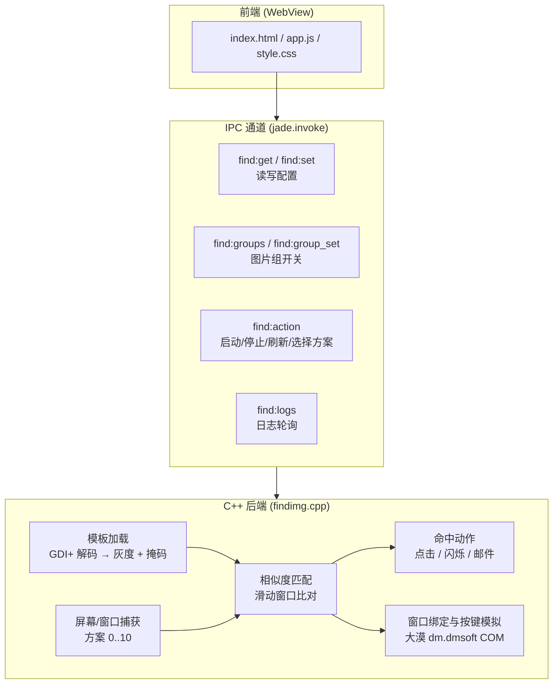
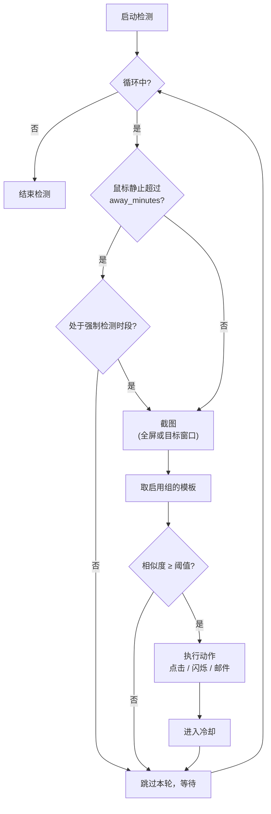

<div align="center">

# 全屏找图

**在屏幕上按图片模板做相似度匹配，命中后自动提醒 / 点击 / 按键**

[](https://isocpp.org/)


[](LICENSE)

</div>

---

## 目录

- [一、项目简介](#一项目简介)
- [二、功能特性](#二功能特性)
- [三、运行环境](#三运行环境)
- [四、目录结构](#四目录结构)
- [五、工作原理](#五工作原理)
- [六、检测流程](#六检测流程)
- [七、编译](#七编译)
- [八、运行](#八运行)
- [九、配置说明](#九配置说明)
- [十、图片模板规范](#十图片模板规范)
- [十一、常见问题](#十一常见问题)
- [十二、许可证](#十二许可证)
- [十三、免责声明](#十三免责声明)

---

## 一、项目简介

全屏找图是一个 Windows 桌面工具：把一批**模板位图**放在 `img/` 目录，程序按固定间隔对屏幕（或指定窗口）截图，
用**灰度相似度 + 掩码匹配**逐张比对模板；一旦某张模板的相似度超过阈值，就按配置触发后续动作 ——
鼠标点击命中位置、全屏闪烁提醒，或发送邮件通知。

程序采用「**WebView 前端 + C++ 后端**」结构：界面由 JadeView 渲染 HTML/CSS/JS，
业务逻辑（截图、匹配、窗口绑定、按键模拟）全部在 C++ 侧，两者通过 IPC 通道通信。

> 本仓库是**可直接编译、开箱可用**的完整工程：JadeView SDK 的运行库/静态库、大漠插件 DLL 与编译好的 exe 均已附带。
> 但**私密配置（SMTP 授权码、大漠注册码）已脱敏外置**，需要你自行填写，详见[第九节](#九配置说明)。

---

## 二、功能特性

| 功能 | 说明 |
| --- | --- |
| 模板相似度匹配 | 灰度化 + 掩码（忽略透明/无效像素），在屏幕或窗口位图上滑动比对 |
| 多种截图方案 | 内置 **11 种**截图方式（方案 0~10），覆盖普通窗口、DWM 合成窗口与游戏/UE 类窗口 |
| 图片组管理 | 自动扫描 `img/` 并按文件名分组，界面上一键启用/禁用整组，状态持久化 |
| 目标窗口选择 | 点「🎯 拖住寻找」并拖到目标窗口上松开，自动取窗口 HWND，无需手抄句柄 |
| 命中动作 | ① 点击命中位置中心；② 全屏闪烁提醒；③ 发送邮件通知（可多选） |
| 离开自动暂停 | 鼠标静止超过设定分钟数即暂停检测，移动鼠标自动恢复 |
| 强制检测时段 | 指定时间段内忽略「离开」状态，持续检测 |
| 挤线模式 | 独立的「挤线」模板触发逻辑，配合按键模拟使用 |
| 按键模拟 | 通过大漠插件绑定窗口，按固定节奏发送按键（需自行配置注册码） |
| 实时日志 | 后端日志写入文件，前端每 0.5 秒同步显示 |

---

## 三、运行环境

| 项目 | 要求 |
| --- | --- |
| 操作系统 | Windows 10 / 11（32 位或 64 位均可，程序为 **x86**） |
| 运行库 | Visual C++ 运行库（因使用 `/MT` 静态链接，通常**无需**额外安装） |
| 大漠插件 | 按键模拟功能需要 `runtime/dm.dll` 注册为 COM 组件 |
| 权限 | 目标窗口为管理员权限时，本程序也需以管理员身份运行 |
| 编译环境 | Visual Studio 2019（MSVC v142）+ Windows SDK 10.0.19041.0（仅在需要自行编译时） |

> ⚠️ **x86 限制**：本程序是 32 位进程。受 Windows 会话隔离限制，32 位进程无法对以管理员权限运行的 64 位窗口截图/绑定。
> 若目标窗口以管理员身份运行，请用 `启动_32位.bat` 以管理员身份启动本程序。

---

## 四、目录结构

```text
Looking-for-pictures/
├── findimg_jade_x86_v9.exe        主程序（WebView 界面版）
├── 全屏找图.exe                    旧版 Win32 界面程序（同一套后端逻辑）
├── JadeView_x86.dll               JadeView 运行时（必需，与 exe 同目录）
├── 启动_32位.bat                   以管理员身份启动主程序
├── 注册_DM_COM_32位.bat            注册 runtime/dm.dll 为 COM 组件
├── build.ps1                      一键编译脚本（VS2019 x86）
├── sync_ui.ps1                    把 style.css / app.js 内联进 index.html
├── findimg_settings.example.json  配置文件示例
├── src/
│   ├── jade_main.cpp              JadeView 入口 + IPC 处理器
│   ├── findimg.cpp                核心后端：截图、匹配、DM 绑定、邮件
│   ├── JadeView.h                 JadeView SDK 头文件
│   ├── findimg_x86.manifest       应用清单（要求管理员权限）
│   └── secrets.example.h          私密配置模板（复制为 secrets.h 使用）
├── lib/                           JadeView 静态库（x86 / x64）
├── runtime/
│   ├── dm.dll                     大漠插件（按键模拟）
│   ├── RegDll.dll                 大漠插件注册辅助
│   ├── JadeView_x64.dll
│   └── jade_ui/web/               前端资源（index.html / app.js / style.css）
├── tools/verify_fix.cpp           诊断工具：直接调用真实匹配链路
├── img/                           图片模板目录（需自建，见第十节）
└── LICENSE
```

> `img/`、`findimg_settings.json`、`findimg.log` 属**本机运行期产物**，已在 `.gitignore` 中排除，仓库不包含。

---

## 五、工作原理

前端只负责呈现与交互，所有判断都在 C++ 后端完成；两者通过 JadeView 的 IPC 通道通信。



要点说明：

- **模板加载用 GDI+**：`Gdiplus::Bitmap` 解码后在进程内转为灰度数组与有效像素掩码。
  注意 GDI+ 必须在使用前显式 `GdiplusStartup()`，否则所有模板都会加载失败。
- **匹配是纯 CPU 的滑动窗口比对**，不做缩放，因此模板尺寸应与目标在屏幕上的实际显示尺寸一致。
- **窗口捕获有 11 种方案**，因为不同渲染方式（普通 GDI 窗口、DWM 合成窗口、UE/游戏窗口）需要不同的抓取手段。
- **按键模拟走大漠插件 COM 接口**（`dm.dmsoft`），需要注册码与窗口绑定才能工作。

---

## 六、检测流程

启动检测后，后台线程按固定间隔循环：先判断是否处于「离开」状态，再逐张模板比对，命中后执行动作。



---

## 七、编译

### 方式一：使用构建脚本

```powershell
# 在项目根目录执行；需要 Visual Studio 2019 (x86 工具链)
.\build.ps1
```

脚本会用 MSVC 编译 `src/jade_main.cpp`，输出 `findimg_jade_x86_v9.exe`。

> 若你的 JadeView SDK 包不在项目内，可设置环境变量 `JADEVIEW_PACKAGE` 指向 SDK 包目录；
> 未设置时脚本直接使用仓库根目录已附带的 `JadeView_x86.dll`。

### 方式二：手动调用 cl.exe

```bash
cd src
cl.exe /std:c++17 /utf-8 /EHsc /O2 /MT /D UNICODE /D _UNICODE /D JADE_FRONTEND /I. \
  jade_main.cpp ..\lib\JadeView_x86.lib gdiplus.lib comctl32.lib shell32.lib user32.lib gdi32.lib \
  uxtheme.lib ole32.lib oleaut32.lib ntdll.lib ws2_32.lib winspool.lib bcrypt.lib advapi32.lib \
  /Fe:..\findimg_jade_x86_v9.exe /link /SUBSYSTEM:WINDOWS /MACHINE:X86 /MANIFEST:EMBED \
  /MANIFESTUAC:NO /MANIFESTINPUT:findimg_x86.manifest
```

编译**旧版 Win32 界面程序**（`全屏找图.exe`）时，去掉 `/D JADE_FRONTEND`，且只编译 `findimg.cpp`：

```bash
cd src
cl.exe /std:c++17 /utf-8 /EHsc /O2 /MT /D UNICODE /D _UNICODE /I. \
  findimg.cpp gdiplus.lib comctl32.lib shell32.lib user32.lib gdi32.lib uxtheme.lib \
  ole32.lib oleaut32.lib ntdll.lib ws2_32.lib winspool.lib bcrypt.lib advapi32.lib \
  /Fe:..\全屏找图.exe /link /SUBSYSTEM:WINDOWS /MACHINE:X86
```

---

## 八、运行

1. （可选）注册大漠插件 —— 双击 `注册_DM_COM_32位.bat`（会请求管理员权限，成功输出 `DM COM registration succeeded.`）。
   只有需要「按键模拟」时才必须做这一步。
2. 在 `img/` 放入模板位图（见第十节）。
3. 双击 `启动_32位.bat` 以管理员身份启动主程序（推荐），或直接运行 `findimg_jade_x86_v9.exe`。
4. 在界面上：点「🎯 拖住寻找」拖到目标窗口 → 勾选要启用的图片组 → 按需勾选动作 → 点「启动检测」。

---

## 九、配置说明

### 9.1 私密配置：`src/secrets.h`

邮箱授权码与大漠注册码**不随仓库分发**。请复制模板并填入自己的值：

```bash
cp src/secrets.example.h src/secrets.h
# 然后编辑 src/secrets.h
```

`src/secrets.h` 已在 `.gitignore` 中，不会被提交。若该文件不存在，程序使用空默认值：
**除「邮件提醒」不可用、「按键模拟」因未注册而失败外，其余功能均正常。**

| 宏 | 用途 |
| --- | --- |
| `FINDIMG_SMTP_USER` | 发件邮箱（QQ 邮箱） |
| `FINDIMG_SMTP_PASS` | QQ 邮箱 **SMTP 授权码**（不是登录密码） |
| `FINDIMG_MAIL_TO` | 收件邮箱 |
| `FINDIMG_DM_CODE` | 大漠插件注册码 |
| `FINDIMG_TARGET_CLASS` / `FINDIMG_TARGET_TITLE` | 默认目标窗口（可选） |

### 9.2 运行配置：`findimg_settings.json`

程序运行时自动在 exe 同目录生成，也可从 `findimg_settings.example.json` 复制一份再改。

| 字段 | 类型 | 默认 | 说明 |
| --- | --- | --- | --- |
| `group_selection` | 对象 | — | 各图片组的开关，键为组名，值为布尔 |
| `threshold` | 字符串 | `0.9` | 相似度阈值，取值 `0.01 ~ 1.0`，越大越严格 |
| `interval` | 字符串 | `10.0` | 每轮扫描的间隔秒数 |
| `cooldown` | 字符串 | `300` | 命中后的冷却秒数 |
| `away_minutes` | 字符串 | `60` | 鼠标静止超过该分钟数即暂停检测，移动后自动恢复 |
| `force_start` / `force_end` | 字符串 | `10` / `14` | 强制检测时段（小时，`0~23`）；该时段内忽略「离开」状态 |
| `target_hwnd` | 字符串 | `""` | 目标窗口句柄（十六进制字符串）；留空则扫描全屏 |
| `scheme` | 字符串 | `1` | 截图方案编号，取值 `0 ~ 10`，`0` 表示旧版全屏截图 |
| `click` | 布尔 | `false` | 命中后点击命中位置中心 |
| `flash` | 布尔 | `false` | 命中后全屏闪烁提醒 |
| `email` | 布尔 | `false` | 命中后发送邮件 |
| `squeeze` | 布尔 | `false` | 启用挤线模式 |

### 9.3 截图方案对照

| 编号 | 名称 | 编号 | 名称 |
| --- | --- | --- | --- |
| 0 | 旧版全屏找图 | 6 | 屏幕窗口区域 |
| 1 | PrintWindow 完整渲染 | 7 | DWM 合成缩略图 |
| 2 | PrintWindow 兼容渲染 | 8 | DWM 扩展边界截图 |
| 3 | WM_PRINT 控件渲染 | 9 | Windows Graphics Capture |
| 4 | 窗口 DC 位图 | 10 | UE/游戏专用捕获 |
| 5 | 客户区 DC 位图 | | |

> 先用界面上的「测」按钮逐个试，能正确抓到目标窗口画面的方案才可用；抓不到的方案命中率会很低。

---

## 十、图片模板规范

- **位置**：全部放在 `img/` 目录，**不递归子目录**。
- **格式**：`.bmp` / `.png` / `.jpg` / `.jpeg` / `.webp`。
- **分组规则**：取文件名去掉扩展名后，**删除末尾连续数字**作为组名。
  例如 `打雷2.bmp`、`打雷5.bmp` 同属「打雷」组；`月下.bmp` 属「月下」组。
  界面上显示为 `组名 (N张)`，其中 N 为该组文件数。
- **尺寸**：匹配不做缩放，模板尺寸需与目标在屏幕上的**实际显示尺寸一致**。
  尺寸不匹配会导致相似度骤降。
- **挤线模板**：文件名以「挤线」开头的模板不参与普通分组，而是作为**挤线模式**的触发模板单独使用。
- **建议**：同一组内放多张不同状态/角度的截图，可显著提升命中率。

> 仓库**不包含** `img/` 目录（属本机资源）。请自建该目录并放入自己的模板。

---

## 十一、常见问题

**Q：扫描时提示「没有启用且可读取的图片模板」？**

按顺序排查：

1. `img/` 目录是否存在、里面有没有图片；
2. 界面上对应图片组是否已勾选启用；
3. 若图片组列表为空，点界面上的「刷新」重新扫描；
4. 若开发时自定义构建，确认在初始化流程中调用了 `GdiplusStartup()` —— 缺少它会导致所有模板加载失败。

**Q：勾选了图片组，重启后开关又变回去了？**

配置文件 `findimg_settings.json` 解析失败时会回落到默认值（全部启用）。
确认该文件是合法 JSON（注意不要有多余逗号）。

**Q：截图是黑屏 / 空白？**

换一个截图方案（用「测」按钮逐个试）。普通窗口用方案 1~5，DWM 合成窗口试 7~8，游戏/UE 窗口试 10。

**Q：按键模拟失败？**

1. 确认已运行 `注册_DM_COM_32位.bat` 注册 `dm.dll`；
2. 确认已在 `src/secrets.h` 填入有效的 `FINDIMG_DM_CODE` 并**重新编译**；
3. 确认以管理员身份运行。

**Q：以管理员身份运行的目标窗口抓不到画面 / 绑定失败？**

32 位进程无法跨权限级别操作。请同样以管理员身份运行本程序。

**Q：邮件发不出去？**

确认 `src/secrets.h` 中填的是 QQ 邮箱的 **SMTP 授权码**（16 位）而非登录密码，并已在邮箱设置中开启 SMTP 服务。

---

## 十二、许可证

本项目以 [GNU General Public License v3.0](LICENSE) 发布。

> 仓库内附带的第三方组件（JadeView SDK 的 DLL/静态库/头文件、大漠插件 `dm.dll` 等）版权归各自作者所有，
> 仅为本工程编译/运行便利而收录，**其使用需遵守各自许可协议**。若不接受，请删除对应文件并自行获取。

---

## 十三、免责声明

- 本项目仅供**学习与技术研究**使用，请勿用于任何违反法律法规或第三方服务条款的场景。
- 使用者需自行承担因使用本工具产生的一切后果，包括但不限于目标软件服务条款风险与账号风险。
- 请勿将本工具用于未授权的自动化操作；因滥用造成的任何损失，作者不承担责任。

<div align="center">

<sub>如果这个项目对你有帮助，欢迎点个 Star ⭐</sub>

</div>
